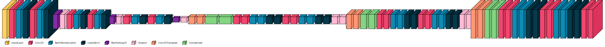
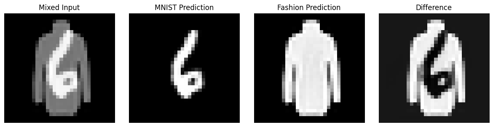
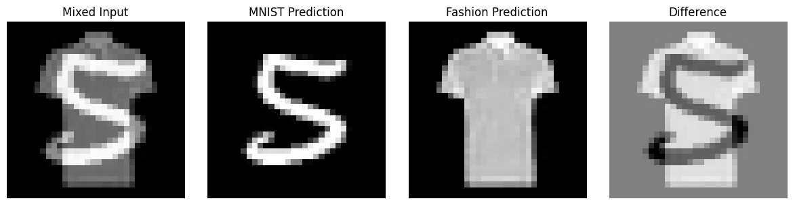
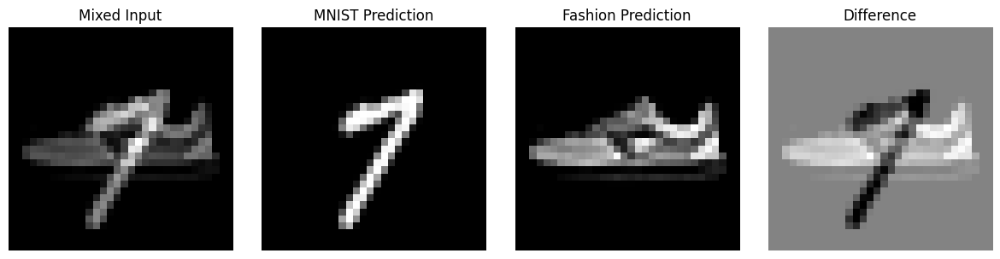

# EncoderDecoder-Model-for-Blind-Source-Separation-task

## Overview
This project implements a encoder-decoder solution for blind source separation of combined images. The goal is to separate a composite image, created by adding two distinct images from different datasets (MNIST and Fashion-MNIST), back into its original components without any preprocessing.

## Problem Statement
Given a combined image that is the sum of two source images (one from MNIST and one from Fashion-MNIST), the neural network must predict and reconstruct the original component images. This is achieved through direct processing of the combined input, with performance measured using Mean Squared Error (MSE) between the predicted and ground-truth images.

## Dataset Details
- **Source 1**: MNIST dataset (handwritten digits)
- **Source 2**: Fashion-MNIST dataset (fashion items)
- **Image Specifications**:
  - Grayscale images
  - Padded to 32x32 resolution
  - No preprocessing allowed

## Model Architecture
The solution implements an encoder-decoder architecture with a dual-decoder structure, designed to separate the combined input image into its original components.

### Input Layer
- Accepts a single grayscale image (32×32×1)
- Represents the combination of MNIST and Fashion-MNIST source images

### Encoder
The encoder consists of three blocks, each containing:
- Two convolutional layers with increasing filter counts:
  - Block 1: 64 filters
  - Block 2: 128 filters
  - Block 3: 256 filters
- Batch normalization after each convolution
- LeakyReLU activation functions
- Max pooling for spatial downsampling
- Dropout for regularization
- Skip connections preserved before each pooling operation (skip1, skip2, skip3)

### Dual Decoders
Two parallel decoders process the encoded representation to reconstruct:
1. MNIST image component
2. Fashion-MNIST image component

Each decoder includes:
- Transposed convolution layers for upsampling
- Skip connection integration from the encoder
- Post-concatenation convolutions with:
  - Batch normalization
  - LeakyReLU activation
  - Dropout regularization
- Final 1×1 convolution with sigmoid activation for output generation

### Output
- Two separate output branches:
  - "mnist_output": Reconstructed MNIST image (32×32×1)
  - "fashion_output": Reconstructed Fashion-MNIST image (32×32×1)
- Pixel values normalized between 0 and 1

## Technical Implementation
### Input
- Combined image (img1 + img2) with shape (32, 32)

### Output
- Two separated images:
  - hat_img1: Predicted first component
  - hat_img2: Predicted second component

### Evaluation Metric
- Mean Squared Error (MSE) between:
  - Predicted hat_img1 and original img1
  - Predicted hat_img2 and original img2

## Results
### Performance Metrics
- Mean Squared Error (MSE): 0.0004269973
- Standard Deviation: 0.0000057204

These metrics demonstrate the model's high accuracy in separating the combined images into their original components, with very low error and consistent performance across samples.

### Visual prediction

